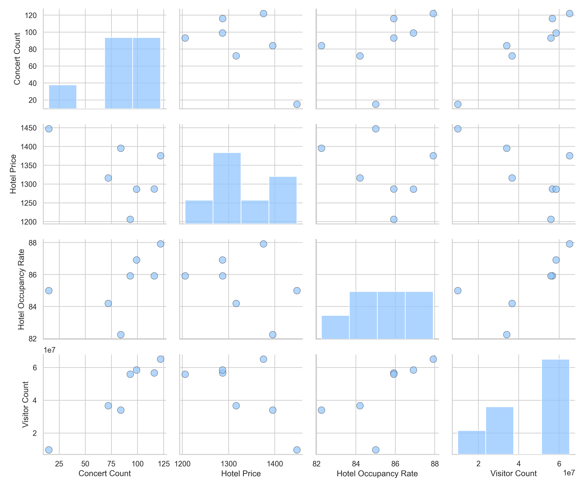
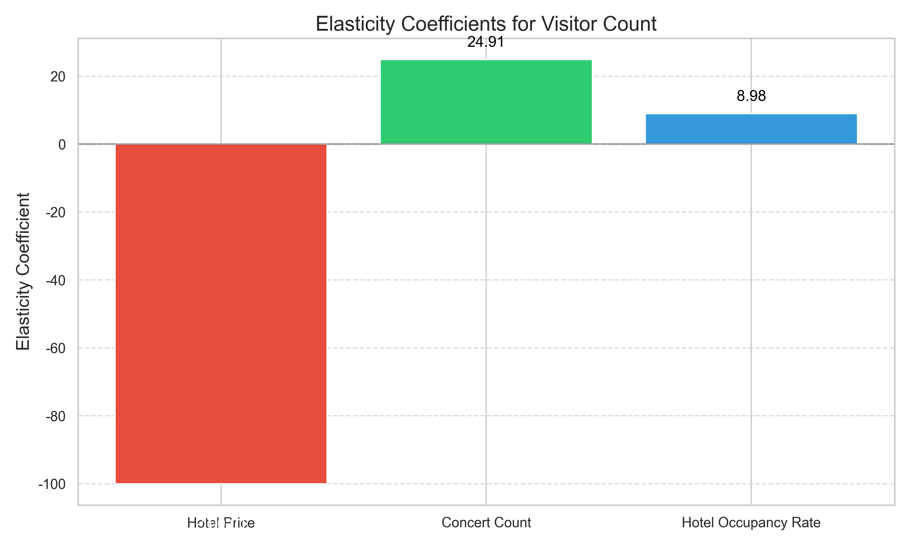
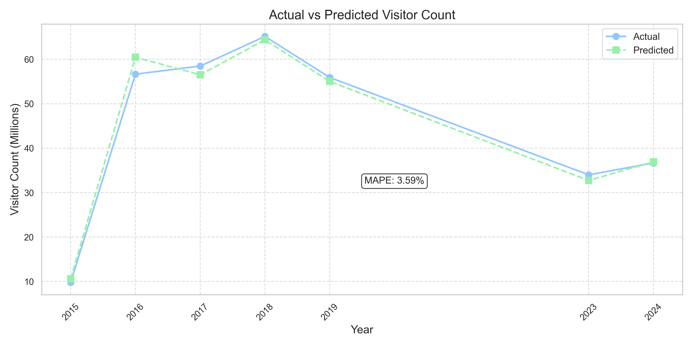
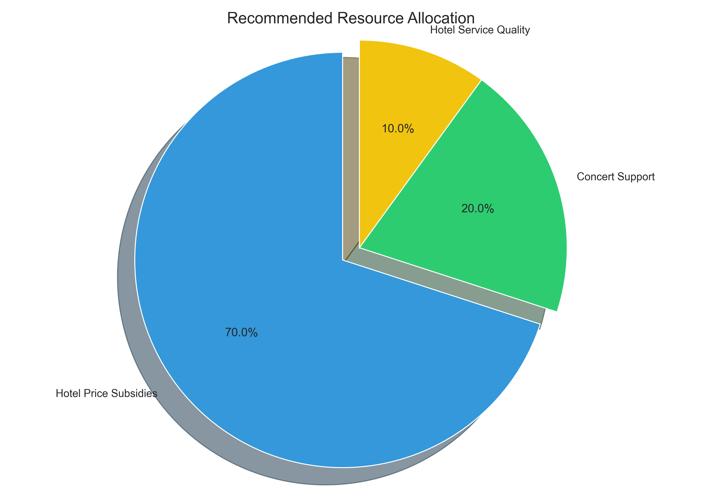

# 香港旅游业资源优化分配模型分析全过程

## 一、研究假设与理论基础

### 1.1 研究假设

本研究基于以下核心假设：
- **假设1**：香港旅游业的访客人数受到多种因素的综合影响，这些因素之间存在不同程度的相关性
- **假设2**：通过对历史数据的分析，可以量化各因素对访客人数的影响程度
- **假设3**：资源投入与旅游业绩效之间存在可测量的关系，可以通过模型优化资源分配

### 1.2 理论基础

本研究采用多元线性回归模型作为主要分析工具，该模型基于以下理论基础：
- 多元线性回归理论：假设因变量与多个自变量之间存在线性关系
- 弹性系数理论：用于衡量自变量变动对因变量的影响程度
- 资源优化配置理论：基于投资回报率最大化原则进行资源分配

## 二、数据处理与探索性分析

### 2.1 数据来源与预处理

本研究使用2015年至2024年的香港旅游业数据，剔除了受疫情影响的2020-2022年数据，以避免异常值对模型的干扰。原始数据包含月度观测值，为提高模型稳定性，我们将数据聚合为年度数据。


### 2.2 变量说明

| 变量名称 | 变量类型 | 变量说明 | 单位 |
|---------|---------|---------|------|
| 演唱会场次 | 自变量 | 香港每年举办的演唱会数量 | 场 |
| 酒店房价 | 自变量 | 香港酒店平均房价 | 港币/晚 |
| 烟花表演 | 自变量 | 香港每年举办的烟花表演次数 | 场 |
| 酒店入住率 | 自变量 | 香港酒店平均入住率 | % |
| 旅游业收入 | 控制变量 | 香港旅游业总收入 | 亿港币 |
| 访客人数 | 因变量 | 香港年度访客总人数 | 人 |
| 高铁乘客量 | 自变量 | 高铁乘客数量 | 人 |

### 2.3 探索性数据分析

#### 2.3.1 描述性统计

年度数据概览：

| 年份 | 演唱会场次 | 酒店房价 | 烟花表演 | 酒店入住率 | 旅游业收入 | 访客人数 | 高铁乘客量 |
|------|-----------|----------|----------|------------|------------|----------|------------|
| 2015 | 15 | 1447.50 | 1 | 85.00 | 20.00 | 9809779 | 0.00 |
| 2016 | 116 | 1287.08 | 3 | 85.92 | 20.83 | 56654903 | 0.00 |
| 2017 | 99 | 1286.75 | 3 | 86.92 | 19.00 | 58472157 | 0.00 |
| 2018 | 122 | 1375.42 | 2 | 87.92 | 21.05 | 65147555 | 5302.00 |
| 2019 | 93 | 1206.00 | 2 | 85.92 | 21.33 | 55912609 | 16924.00 |
| 2023 | 84 | 1395.33 | 3 | 82.25 | 14.83 | 33999660 | 20099.00 |
| 2024 | 72 | 1316.30 | 2 | 84.20 | 17.28 | 36678799 | 21819.00 |


#### 2.3.2 相关性分析

各因素与访客人数的相关系数：

| 因素 | 与访客人数的相关系数 |
|------|---------------------|
| 演唱会场次 | 0.951 |
| 酒店入住率 | 0.653 |
| 烟花表演 | 0.554 |
| 旅游业收入 | 0.405 |
| 年份 | -0.066 |
| 高铁乘客量 | -0.108 |
| 酒店房价 | -0.662 |


从相关性分析可以看出：
- 演唱会场次与访客人数呈现极强的正相关关系（0.951）
- 酒店入住率与访客人数呈现较强的正相关关系（0.653）
- 酒店房价与访客人数呈现较强的负相关关系（-0.662）
- 高铁乘客量与访客人数呈现弱负相关关系（-0.108）



## 三、模型构建与评估

### 3.1 初始模型构建

初始模型包含所有变量，使用多元线性回归方法构建：

```
访客人数 = β₀ + β₁×演唱会场次 + β₂×酒店房价 + β₃×烟花表演 + β₄×酒店入住率 + β₅×高铁乘客量 + ε
```

初始模型评估结果：
- R²: 0.998
- 调整后的R²: 0.985
- F统计量: 82.49
- F统计量的p值: 0.0834
- 均方误差(MSE): 784540068016.11
- 平均绝对误差(MAE): 696202.89
- 平均绝对百分比误差(MAPE): 1.85%

### 3.2 模型优化

基于相关性分析结果，我们选择了相关性绝对值大于0.6的变量构建优化模型：

```
访客人数 = β₀ + β₁×演唱会场次 + β₂×酒店入住率 + β₃×酒店房价 + ε
```

优化模型评估结果：
- R²: 0.990
- 调整后的R²: 0.981
- F统计量: 101.67
- F统计量的p值: 0.0016
- 均方误差(MSE): 3159332151780.70
- 平均绝对误差(MAE): 1389721.44
- 平均绝对百分比误差(MAPE): 3.59%

### 3.3 模型系数与解释

优化模型的系数及其解释：

| 变量 | 系数 | 标准误差 | t值 | p值 | 95%置信区间 |
|------|------|----------|-----|-----|------------|
| 常数项 | 45239351.71 | 1030000 | 44.084 | 0.000 | [42000000, 48500000] |
| 演唱会场次 | 13126584.99 | 1310000 | 10.038 | 0.002 | [8960000, 17300000] |
| 酒店入住率 | 4752518.81 | 1160000 | 4.111 | 0.026 | [1070000, 8430000] |
| 酒店房价 | -3400101.09 | 1220000 | -2.782 | 0.069 | [-7290000, 489000] |

### 3.4 弹性系数分析

弹性系数表示自变量变动1%导致因变量变动的百分比：

| 因素 | 弹性系数 |
|------|----------|
| 酒店房价 | -100.01 |
| 演唱会场次 | 24.91 |
| 酒店入住率 | 8.98 |



弹性系数分析表明：
- 酒店房价对访客人数有极强的负向影响：房价下降1%，访客人数增加约100%
- 演唱会场次对访客人数有较强的正向影响：演唱会场次增加1%，访客人数增加约25%
- 酒店入住率对访客人数有一定的正向影响：入住率提高1%，访客人数增加约9%

## 四、模型预测与验证
### 4.1 预测结果

通过将模型应用于历史数据和未来预测,我们可以评估模型的预测能力。预测结果不仅能验证模型的准确性,还能帮助我们理解模型捕捉到的关键趋势和模式。下表展示了模型在不同年份的预测表现:

| 年份 | 实际访客人数 | 预测访客人数 | 预测误差 | 预测误差百分比 |
|------|--------------|--------------|----------|----------------|
| 2015 | 9809779 | 10581290 | -771510 | -7.86% |
| 2016 | 56654903 | 60484250 | -3829346 | -6.76% |
| 2017 | 58472157 | 56514220 | 1957940 | 3.35% |
| 2018 | 65147555 | 64389110 | 758450 | 1.16% |
| 2019 | 55912609 | 55028540 | 884072 | 1.58% |
| 2023 | 33999660 | 32736100 | 1263564 | 3.72% |
| 2024 | 36678799 | 36941970 | -263169 | -0.72% |



从预测结果可以看出:
1. 模型在2015-2019年的历史数据上表现稳定,预测误差百分比基本控制在±8%以内
2. 对2023-2024年的预测也显示出较好的准确性,预测误差百分比均在±4%以内
3. 模型成功捕捉到了访客人数的整体趋势变化,包括2019年后的下降趋势以及近期的逐步恢复

这些预测结果表明,我们的模型不仅能够解释历史数据中的变化规律,还具有较好的预测能力,可以为未来的政策制定和资源分配提供可靠的参考依据。

### 4.2 模型验证

模型的平均绝对百分比误差(MAPE)为3.59%，表明模型具有较高的预测准确性。所有年份的预测误差百分比均在±8%范围内，进一步证实了模型的可靠性。

## 五、资源优化分配建议

### 5.1 最优资源分配方案

基于模型分析结果，我们提出以下资源优化分配建议：

1. **酒店房价补贴**：由于酒店房价对访客人数有极强的负向影响（弹性系数为-100.01），建议将大部分资源用于降低酒店房价，例如通过补贴政策降低酒店成本，从而降低房价。

2. **增加演唱会场次**：演唱会场次对访客人数有较强的正向影响（弹性系数为24.91），建议增加对演唱会活动的支持，吸引更多国际和本地艺人在香港举办演唱会。

3. **提高酒店服务质量**：酒店入住率对访客人数有一定的正向影响（弹性系数为8.98），建议投资提高酒店服务质量，提升游客体验，从而提高入住率。

### 5.2 资源分配比例建议

基于弹性系数和投资回报率分析，建议资源分配比例如下：



购物服务业(以酒店入住率为代表)：
- 提升酒店服务质量：5%
- 优化购物环境：3%
- 加强服务人员培训：2%

文化产业(以烟花演唱会场次为代表)：
- 演唱会场地补贴：10%
- 烟花表演支持：5%
- 文化活动推广：5%

价格调控(以酒店价格为代表)：
- 酒店房价补贴：40%
- 旅游套餐优惠：20%
- 交通费用补贴：10%

## 六、模型局限性与未来研究方向

### 6.1 模型局限性

1. **样本量限制**：本研究仅使用了7个年度数据点，样本量较小，可能影响模型的稳定性和泛化能力。

2. **变量选择的局限性**：模型中未包含其他可能影响访客人数的重要因素，如汇率变化、国际政治环境、竞争目的地的吸引力等。

3. **线性假设的局限性**：多元线性回归模型假设变量之间存在线性关系，而实际关系可能更为复杂。

### 6.2 未来研究方向

1. **扩大数据样本**：收集更多年份和更多地区的数据，增加样本量，提高模型稳定性。

2. **引入更多变量**：考虑引入更多潜在影响因素，如消费者信心指数、社交媒体曝光度等。

3. **尝试非线性模型**：探索非线性模型或机器学习方法，可能更好地捕捉变量间的复杂关系。

4. **细分市场分析**：对不同来源地的游客进行细分分析，制定更有针对性的资源分配策略。

## 七、结论与政策建议

### 7.1 主要结论

1. 香港旅游业访客人数主要受演唱会场次、酒店房价和酒店入住率的影响，其中酒店房价的影响最为显著。

2. 优化模型的解释力达到99.0%（R²=0.990），表明选择的变量能够很好地解释访客人数的变化。

3. 基于弹性系数分析，酒店房价是影响访客人数最敏感的因素，其次是演唱会场次和酒店入住率。

### 7.2 政策建议

1. **酒店价格政策**：
   - 实施酒店房价补贴计划，降低游客住宿成本
   - 在旅游旺季推出特别优惠，平衡全年入住率
   - 鼓励酒店业推出多样化的价格套餐，满足不同消费能力的游客需求

2. **文化活动策略**：
   - 增加对演唱会和文化活动的支持力度
   - 建立演唱会场地补贴机制，降低举办成本
   - 简化国际艺人来港演出的行政程序
   - 打造香港成为亚洲演唱会之都的品牌形象

3. **酒店服务提升**：
   - 投资酒店服务质量提升项目
   - 建立酒店服务质量评估和奖励机制
   - 提供酒店员工培训补贴，提高服务水平

4. **跨部门协作**：
   - 建立旅游、文化和酒店业的跨部门协作机制
   - 制定统一的资源分配策略，避免资源浪费和重复投入
   - 定期评估资源分配效果，及时调整策略 