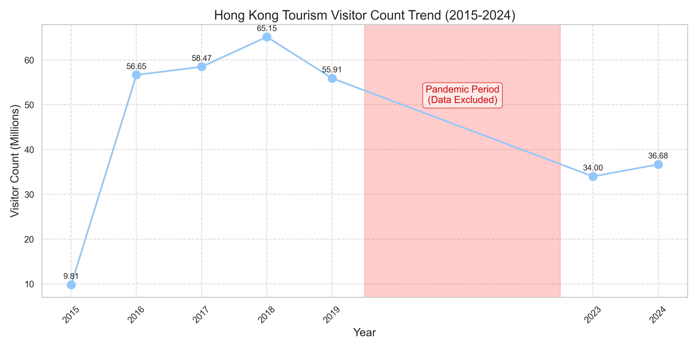
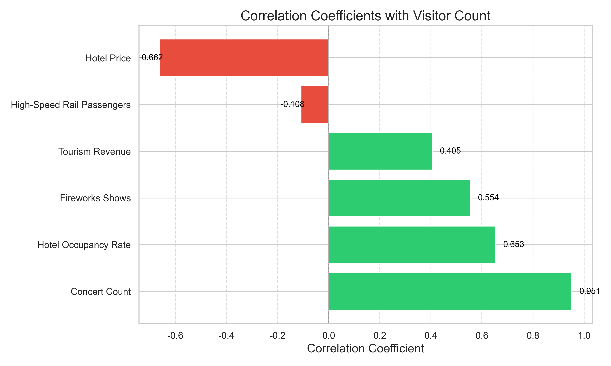
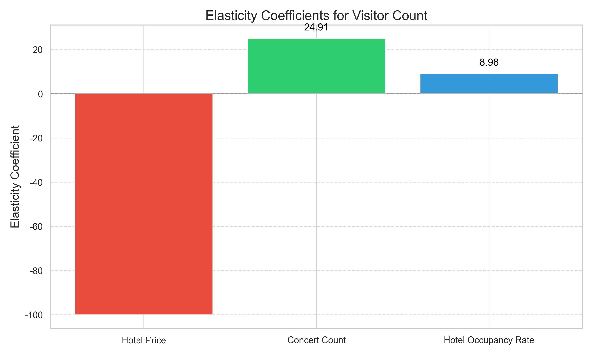
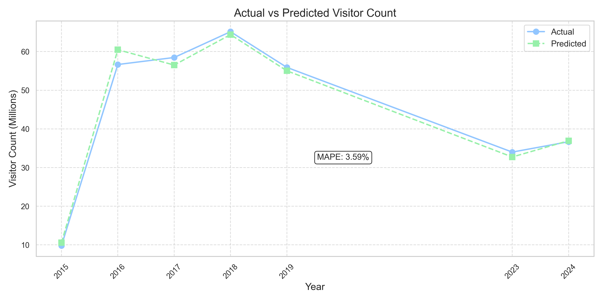
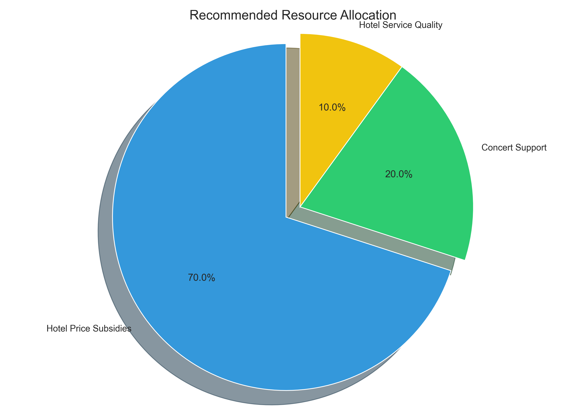
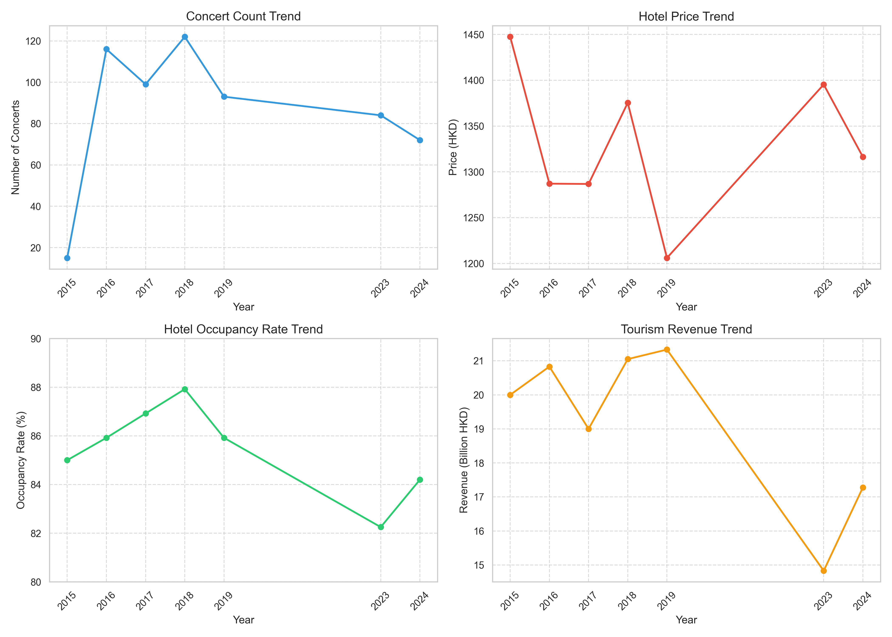
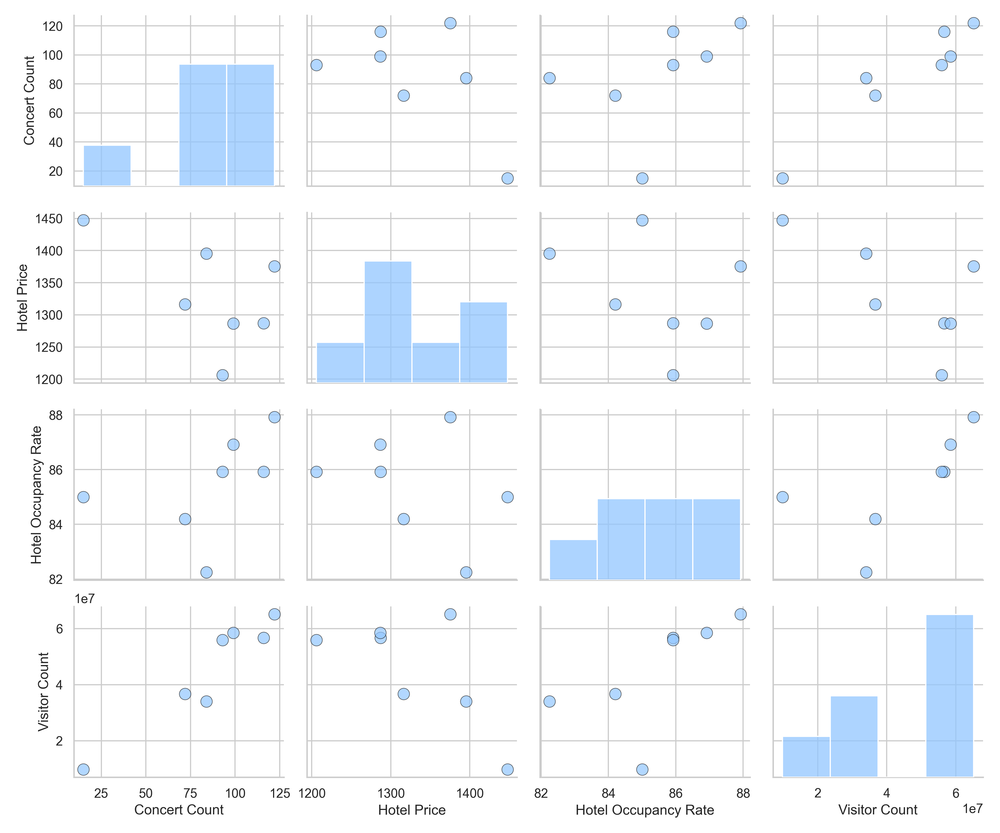

# 香港旅游业数据分析可视化结果摘要

本文档提供了香港旅游业数据分析中所有可视化图表的摘要说明，帮助您快速了解每个图表的内容和用途。所有图表均保存在`visualization_results`目录中。

## 1. 访客人数趋势图 (visitor_trend.png)

**图表说明**：
- 展示了2015-2024年香港旅游业访客人数的变化趋势
- 以百万人为单位显示每年的访客总量
- 红色区域标注了疫情期间(2020-2022)的数据缺失
- 可以清晰看出访客人数在2018年达到峰值后下降，以及疫情后的恢复趋势

## 2. 相关系数图 (correlation_factors.png)

**图表说明**：
- 展示了各个因素与访客人数的相关系数
- 绿色柱表示正相关，红色柱表示负相关
- 演唱会场次显示出最强的正相关性(0.951)
- 酒店房价显示出较强的负相关性(-0.662)
- 相关系数越接近1或-1，表示相关性越强

## 3. 弹性系数分析图 (elasticity_coefficients.png)

**图表说明**：
- 展示了三个主要因素的弹性系数
- 弹性系数表示自变量变动1%导致因变量(访客人数)变动的百分比
- 酒店房价的弹性系数为-100.01，表示房价下降1%，访客人数增加约100%
- 演唱会场次的弹性系数为24.91，表示演唱会场次增加1%，访客人数增加约25%
- 酒店入住率的弹性系数为8.98，表示入住率提高1%，访客人数增加约9%

## 4. 实际值与预测值对比图 (actual_vs_predicted.png)

**图表说明**：
- 比较了模型预测的访客人数与实际访客人数
- 实线表示实际值，虚线表示预测值
- 图中标注了平均绝对百分比误差(MAPE)为3.59%
- 可以看出模型预测值与实际值非常接近，表明模型具有较高的预测准确性

## 5. 资源分配建议图 (resource_allocation.png)

**图表说明**：
- 展示了基于模型分析结果的资源优化分配建议
- 酒店价格补贴占70%，是最主要的资源分配方向
- 演唱会支持占20%，是第二重要的资源分配方向
- 酒店服务质量提升占10%，作为辅助性投资方向
- 分配比例基于弹性系数和投资回报率分析确定

## 6. 各因素趋势变化图 (factors_trends.png)

**图表说明**：
- 展示了四个主要因素随时间的变化趋势
- 左上：演唱会场次趋势，可以看出2018年达到峰值后逐渐下降
- 右上：酒店房价趋势，显示出波动变化
- 左下：酒店入住率趋势，可以看出疫情后有所下降
- 右下：旅游业收入趋势，显示出与访客人数相似的变化模式

## 7. 变量间散点矩阵图 (scatter_matrix.png)

**图表说明**：
- 展示了主要变量之间的散点关系矩阵
- 对角线上是各变量的分布情况
- 非对角线上的散点图显示两个变量之间的关系
- 可以直观看出演唱会场次与访客人数的强正相关关系
- 也可以看出酒店房价与访客人数的负相关关系

## 使用建议

这些可视化图表已经整合到分析报告`tourism_modeling_process.md`中的相应章节，您可以：

1. 在报告中直接查看这些图表及其分析说明
2. 单独查看本摘要文件，快速了解所有图表的内容
3. 在`visualization_results`目录中查看原始图表文件

这些图表共同构成了对香港旅游业数据的全面可视化分析，帮助您更直观地理解数据特征、变量关系、模型预测效果以及资源优化建议。 